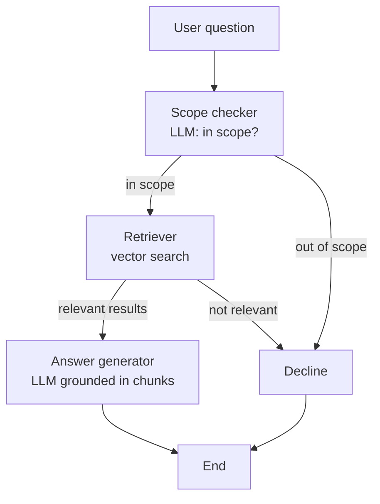

# PECA 2016 Law Agent

An AI agent (LangGraph + LangChain + Gemini) that answers questions about one Pakistani law:
**The Prevention of Electronic Crimes Act, 2016 (Act No. XL of 2016)**.

Unlike a plain RAG chatbot (which always retrieves and always answers), this agent **decides**:

1. Is the question even about this Act? (Scope Checker)
2. If yes, search the document. If no, decline without searching.
3. Did the search return anything relevant enough? (Retriever)
4. If yes, answer from the retrieved text only. If no, admit it cannot answer.

## Workflow



## Repo structure

```
pk_law_agent/
├── data/                    # the law PDF (scanned Gazette)
├── indexing/
│   └── build_index.py       # ONE-TIME: PDF -> OCR -> sections -> chunks -> embeddings -> Chroma
├── agent/
│   ├── state.py             # AgentState (pydantic)
│   ├── tools.py             # scope_checker, retriever, answer_generator, decline
│   └── graph.py             # LangGraph wiring and conditional routing
├── chroma_db/               # prebuilt vector store (committed so the container needs no re-indexing)
├── settings.py              # all tunable values
├── main.py                  # FastAPI app (/health, /ask) and CLI test runner
├── Dockerfile
└── requirements.txt
```

Indexing is deliberately **not** part of the graph: loading a PDF and embedding it is setup, not a decision.
The agent has three runtime tools only: Scope Checker, Retriever, Answer Generator (plus a Decline node).

## Agent state

Every node reads and writes one pydantic object, `AgentState`:
`question`, `in_scope`, `scope_reason`, `retrieved_chunks` (text, section, similarity score),
`retrieval_sufficient`, `final_answer`, `status`, `execution_path`.
Each node appends its own name to `execution_path`, which is how the path is logged.

## Setup

```bash
python -m venv .venv
.venv\Scripts\activate            # Windows
pip install -r requirements.txt
```

Create `.env` in the project root (never commit it):

```
GEMINI_API_KEY=your_key_here
```

### Build the index (one time)

Needs Tesseract OCR and the OCR libraries (`pip install pymupdf pytesseract pillow`) because the source PDF is a scan.
The prebuilt `chroma_db/` is already in the repo, so you can skip this step.

```bash
python -m indexing.build_index
```

### Run locally

```bash
uvicorn main:app --reload          # API on http://127.0.0.1:8000  (docs at /docs)
python main.py                     # CLI: runs one question per category and logs the path
```

### Run with Docker

```bash
docker build -t pk-law-agent .
docker run -d --name pk-law --env-file .env -p 8000:8000 pk-law-agent
```

`.env` is excluded from the image by `.dockerignore`; the key is supplied at run time.

## API

| Method | Path | Description |
|---|---|---|
| GET | `/health` | Service status |
| POST | `/ask` | Body `{"question": "..."}`; returns answer, status, scope decision and `execution_path` |

## Test results (run against the Docker container)

Three question categories, each taking a different path:

| Category | Question | Path | Status |
|---|---|---|---|
| In scope, answerable | What is the punishment for cyber stalking? | `scope_checker -> retriever -> answer_generator` | `answered` |
| Out of scope | How do I bake a chocolate cake? | `scope_checker -> decline` | `out_of_scope` |
| In scope, not answerable from the Act | How many people were prosecuted under this Act in its first year after enactment? | `scope_checker -> retriever -> decline` | `no_results` |

Sample response (out of scope):

```json
{
  "question": "How do I bake a chocolate cake?",
  "in_scope": false,
  "scope_reason": "The question is about baking and unrelated to the Prevention of Electronic Crimes Act, 2016.",
  "status": "out_of_scope",
  "answer": "I can only answer questions about the Prevention of Electronic Crimes Act, 2016. That question is outside what I have information on.",
  "execution_path": ["scope_checker", "decline"]
}
```

Sample response (in scope, but the Act does not contain the answer):

```json
{
  "question": "How many people were prosecuted under this Act in its first year after enactment?",
  "in_scope": true,
  "scope_reason": "The question concerns prosecutions and enforcement statistics under the Prevention of Electronic Crimes Act (PECA), 2016.",
  "status": "no_results",
  "answer": "I don't have enough information in the Prevention of Electronic Crimes Act, 2016 to answer that question.",
  "execution_path": ["scope_checker", "retriever", "decline"]
}
```

Sample answer (in scope, answerable): the agent cited Section 24(2): imprisonment up to three years or a fine up to one million rupees or both, and up to five years or a fine up to ten million rupees where the victim is a minor.

## Design decisions

- **Scope Checker is an LLM call that judges topic only.** Whether the document actually contains the answer is the Retriever's job. An early version of the prompt mixed the two and wrongly declined in-scope questions before retrieval; the prompt now says to judge by topic.
- **Retrieval threshold (0.68) is calibrated, not guessed.** The Chroma collection uses cosine distance and the score is `1 - distance`. A clearly answerable question scored 0.797, while an in-scope question the Act does not answer scored 0.659. The original threshold of 0.60 let the second case through to the Answer Generator; raising it to 0.68 routes it to Decline.
- **Fail safe.** If the Scope Checker call fails (API error), the agent declines instead of answering unguarded. Answer generation errors return `status: error` rather than crashing.
- **Structured LLM output is validated** with pydantic (`ScopeVerdict`), and the response parser handles Gemini returning content either as a string or as a list of parts.
- **Section-aware chunking.** Chunks follow the Act's 55 numbered sections (chunk size 1000, overlap 200 only inside long sections), with the section number kept as metadata for citations.
- **OCR.** The PDF is a scan whose embedded text layer is garbled. Pages are re-read with Tesseract at 300 DPI, Gazette headers are removed, and sections are found by searching for headings in sequence (1, 2, 3, ...) so OCR digit confusions (`8` read as `8B`, `5` read as `§`) do not lose sections. A second, unrelated Act printed at the end of the PDF is cut out.

## Known limitations

- Gemini free tier allows 20 requests per day per model. During testing the quota was exhausted more than once, and Google returned temporary `503 high demand` errors, so a single `/ask` call (two LLM calls) can take from seconds to several minutes.
- Some OCR noise remains in the indexed text (for example `o1e year` for "one year").
- The index contains the 2016 Gazette text only; later amendments are not included.

## Deployment

Live URL: `<add the deployed URL here>`